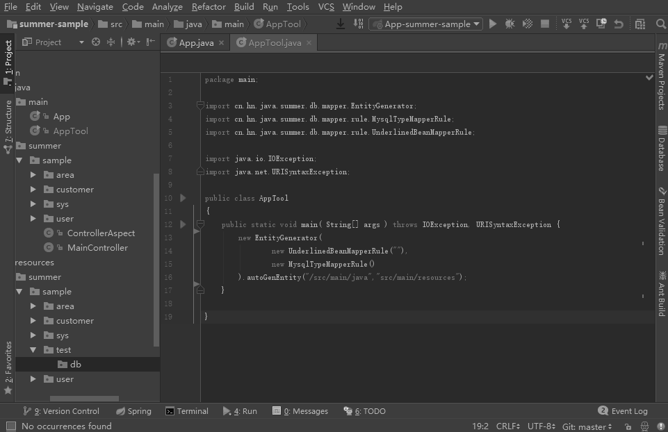
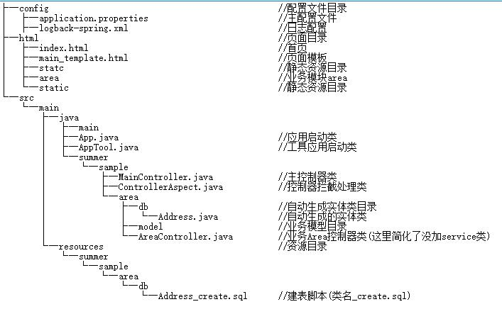

#summer-sample


目录结构：  


本例采用的mysql自带的sakila示例库，脚本[DumpAddress.sql](http://note.youdao.com/)。

**步骤：**  
1、 修改application.properties中数据库连接  
2、 在App.java中配置自动生成实体类存放目录  

```
Config.dbBeanScanFilter=".*sample.*db";
```
3、 在App.java中配置生成实体类规则  
 _这里采用下划线风格（即将字段名your_name转换成yourName）_ 

```
@Bean
    public IBeanMapperRule getBeanMapperRule(){
        return new UnderlinedBeanMapperRule();
    }
```
4、 设置ControllerAspect.java中拦截的规则

```
@Pointcut("execution(public * summer.sample..*.*Controller.*(..))")
```

5、 配置自动生成实体类规则、数据库类型、源码目录和资源目录  
```
new EntityGenerator(
                new UnderlinedBeanMapperRule(""),
                new MysqlTypeMapperRule()
        ).autoGenEntity("/src/main/java","src/main/resources");
```
6、 执行AppTool启动自动实体生成（一旦有脚本更新或添加就会生成对应的实体类文件）  
7、 使用数据库工具生成Address_create.sql建表脚本放在resources对应模块db目录   
     _此时可以看到在对应包目录已经生成了Address.java文件_   
8、 新建AreaController类  

```
@Controller
@RequestMapping("/area")
public class AreaController {
    @Autowired
    BaseDao baseDao;

    @RequestMapping("/getAddresses")
    public List<Address> getAddresses(){
        return baseDao.list(Address.class);
    }
}
```
9、 在html/area目录新建getAddresses.html页面  

```
@import summer.sample.area.db.*
@args List<Address> addressList
    <table>
        @if(addressList){
        @for(Address a : addressList){
        <tr>
            <td>@a.getAddress()</td>
            <td>@a.getDistrict()</td>
            <td>@a.getPostalCode()</td>
            <td>@a.getPhone()</td>
        </tr>
          }}
    </table>
```

然后启动App访问/area/getAddresses.html就能看到结果。  
如果只需json数据则不用建页面，直接访问/area/getAddresses.json即可。  
以后新增只需要执行7、8、9步。
